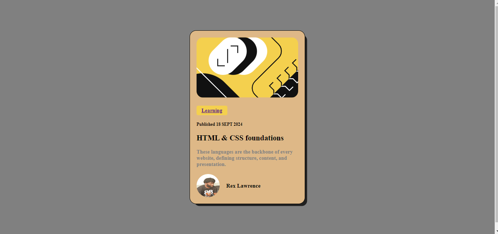

-  Rex Lawrence Blog-price-review-card assignment.


## DESCRIPTION
This is my (REX LAWRENCE) solution to the frontend mentors challenge on Blog-price-review-card submission


## Table of contents

- [DESCRIPTION](#description)
- [Table of contents](#table-of-contents)
- [Overview](#overview)
  - [The challenge](#the-challenge)
  - [Links](#links)
- [My process](#my-process)
  - [Built with](#built-with)
  - [what i learned](#what-i-learned)
  - [Areas to develop](#areas-to-develop)
  - [Useful resources](#useful-resources)
  - [Author](#author)
## Overview

### The challenge 
- I was able to tackle the challenge :

Users should be able to:

- See hover and focus states for all interactive elements on the page


 By solving the above challenge with the hover comand.
  

  

 ### Links
 - solution url: [https://github.com/Binary-R/blog-preview-card]
 - live site url: [http://127.0.0.1:5500/]
  

## My process
### Built with
- Semantic HTML5 markup
- CSS custom properties
- hover feature
- anchor tag feature
- media query
  
  
  ### what i learned
  i learnt the use of the hover feature and the media query

  
  ```html
  <a class="category" title="w3schools" target="_blank" href="https://www.w3schools.com/html/default.asp">Learning</a>
  ```
  
  ```css
  .button:hover {
    cusor: pointer;
  }
  ```

  ### Areas to develop
  - I want to improve my knowledge on css designs and pefecft my html language skills

  ### Useful resources 
  i used just one resource for everytime i felt lost or stucked and that is the:
  - [w3schools online web tutorials](https://www.w3schools.com/)
  
  ### Author
  - Twitter - [@KHayAY19](https://x.com/KHayAY19?t=6IAMkqU5EYyYJhTkVys-Ww&s=09)

  
